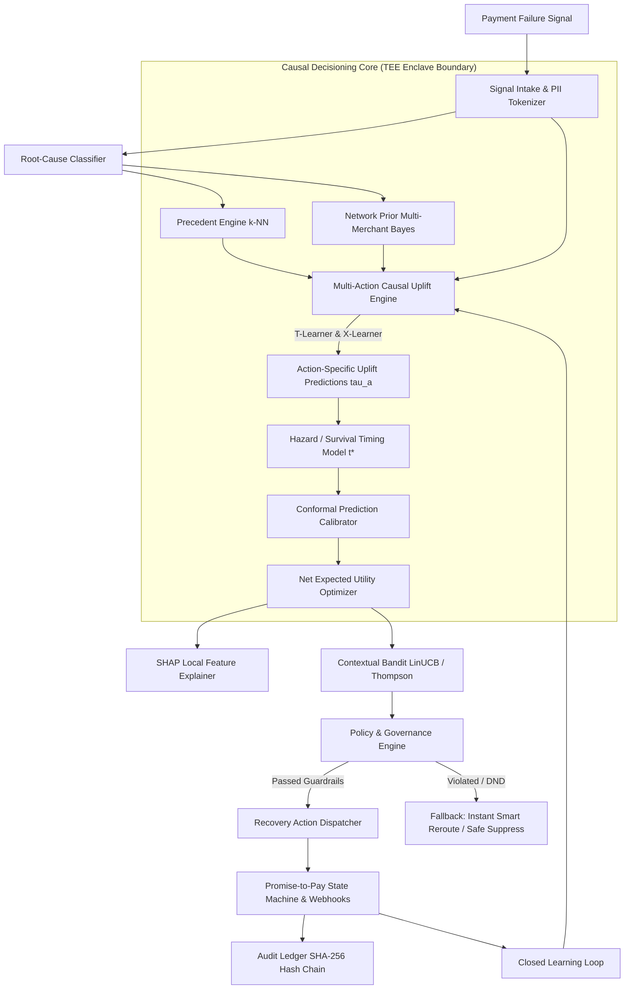

# WAPSI — Razorpay's Recovery Router
### Causal Decisioning for AI Revenue Recovery
**Razorpay AI Buildathon 2026 — Track 3**

---

## 📌 Executive Summary & Core Thesis

Traditional payment recovery solutions answer the wrong question: *"Who is likely to pay?"*
This causes high waste and customer irritation by nudging users who would recover organically (spontaneous retries) or targeting doomed transactions where no intervention helps.

**WAPSI (Razorpay's Recovery Router)** solves the true causal question:
$$\text{ITE}_a(x) = \mathbb{E}[Y(a) - Y(0) \mid X=x]$$
*"Who is more likely to recover **BECAUSE** we take action $a$ versus organic baseline?"*

WAPSI estimates multi-action incremental uplift, computes Net Expected Revenue Utility after direct delivery and customer friction costs, enforces regulatory and merchant guardrails, provides SHAP local explainability, and continuously adapts via an online contextual bandit loop.

---

## 🏛️ System Architecture



---

## ⚡ 18 Architectural Components

1. **Signal Intake**: Ingests failed checkout events, normalized error codes, user history, device context, and merchant metadata.
2. **Root-Cause Classification**: Deterministic & heuristic mapping of failure codes into 4 actionable root-cause categories (`TECHNICAL_GATEWAY`, `FRICTION_OTP_UX`, `FINANCIAL_BALANCE`, `ABANDONMENT_INTENT`).
3. **Precedent Engine ($k$-NN)**: Uses `NearestNeighbors` over failure feature representations to retrieve similar historical cases and synthesize empirical counter-evidence.
4. **Causal Decisioning Core**: Estimates Individual Treatment Effect (ITE) $\tau_a(x) = \mathbb{E}[Y(a) \mid x] - \mathbb{E}[Y(0) \mid x]$ and optimizes Net Expected Revenue Utility:
   $$U(a \mid x) = \tau_a(x) \times \text{Amount} \times \text{MerchantMargin} - \text{Cost}(a) - \text{FrictionCost}(a)$$
5. **Network Prior**: Empirical Bayes shrinkage pooling recovery priors across Razorpay's multi-merchant collective dataset for cold-start stability.
6. **Multi-Action Uplift Meta-Learners**:
   - **T-Learner**: Separate response models $\mu_a(x)$ per action arm.
   - **X-Learner**: 5-stage propensity-weighted crossover residual estimator for high sample-efficiency.
7. **Uplift Evaluation Suite**: Qini Curves, Area Under Uplift Curve (AUUC), and Uplift Decile tables against synthetic ground truth potential outcomes.
8. **Hazard / Survival Timing Model**: Parametric hazard estimator that determines the optimal delay window $t^*$ (e.g. 15s for smart retry, 2m for WhatsApp 1-click).
9. **Conformal Calibrator**: Split-conformal prediction intervals $[\tau_{\text{lower}}, \tau_{\text{upper}}]$ providing distribution-free uncertainty guarantees.
10. **SHAP Explainer**: Exact TreeSHAP local feature attributions explaining the primary drivers of predicted uplift.
11. **LLM Explainer & Localizer**: Generates plain-English merchant audit rationale and bounded, channel-safe customer notification copy (*ML decides, LLM explains*).
12. **Contextual Bandit Engine**: LinUCB online learning loop for controlled policy exploration without sacrificing merchant revenue.
13. **Policy & Governance Engine**: Enforces TRAI DND regulations (21:00–09:00 IST), user frequency capping (max 2 nudges/day), margin gates, and merchant channel exclusions.
14. **Execution Simulator**: Dispatches simulated recovery interactions across WhatsApp, SMS, Smart Retry, BNPL, and IVR with idempotency key protection.
15. **Promise-to-Pay Tracker**: State machine (`DISPATCHED` $\to$ `DELIVERED` $\to$ `LINK_OPENED` $\to$ `RETRY_INITIATED` $\to$ `RECOVERED` / `EXPIRED`).
16. **Learning Loop**: Ingests payment outcome callbacks to update online bandit weights and retraining queues.
17. **Security & Governance**: Input validation, HMAC SHA-256 webhook signature verification, tenant isolation, and sliding-window rate limiting.
18. **TEE Enclave Boundary**: Software-simulated confidential computing adapter shielding sensitive customer PII and issuing cryptographic attestation reports.

---

## 🚀 Quickstart & Local Setup

### 1. Installation
```bash
git clone <repo-url>
cd razorpay
pip install -r requirements.txt
```

### 2. Run Test Suite (29 Tests)
```bash
python -m pytest tests/ -v
```

### 3. Run Causal Benchmarks
```bash
python benchmarks/run_benchmarks.py
```

### 4. Launch FastAPI REST Server
```bash
uvicorn wapsi.api.app:app --reload --port 8000
```
Interactive Swagger Documentation will be available at: `http://localhost:8000/docs`

---

## 📡 REST API Specifications

### 1. `POST /api/v1/decide`
Evaluates a failed payment event, calculates causal uplift across all candidate actions, validates policy guardrails, and outputs the optimal recovery action.

**Request Payload:**
```json
{
  "payment_id": "pay_Kx9281aZ",
  "merchant_id": "merch_blitz_retail",
  "amount_in_inr": 2499.00,
  "payment_method": "upi",
  "error_code": "UPI_APP_TIMEOUT",
  "error_description": "User switched app but bank switch timed out after 45 seconds",
  "user_id": "usr_991823",
  "user_device_os": "Android",
  "user_network_type": "4G",
  "historical_orders_count": 5,
  "historical_recovery_rate": 0.40,
  "retry_attempt_number": 1,
  "hour_of_day": 14,
  "merchant_margin": 0.20
}
```

**Response Payload:**
```json
{
  "decision_id": "dec_c8a912fa",
  "payment_id": "pay_Kx9281aZ",
  "recommended_action": "WHATSAPP_ONE_CLICK_LINK",
  "recommended_action_name": "WhatsApp 1-Click Recovery Link",
  "authorized_action": "WHATSAPP_ONE_CLICK_LINK",
  "channel": "whatsapp",
  "execution_status": "AUTHORIZED",
  "root_cause": {
    "error_category": "FRICTION_OTP_UX",
    "category_label": "FRICTION_OTP_UX",
    "confidence": 0.94,
    "root_cause_summary": "UPI collect request timed out in external UPI app"
  },
  "policy_evaluation": {
    "is_allowed": true,
    "proposed_action": "WHATSAPP_ONE_CLICK_LINK",
    "authorized_action": "WHATSAPP_ONE_CLICK_LINK",
    "override_applied": false,
    "violations": [],
    "dnd_active": false,
    "frequency_cap_remaining": 2
  },
  "causal_metrics": {
    "baseline_organic_recovery_prob": 0.142,
    "expected_action_recovery_prob": 0.528,
    "individual_treatment_effect_uplift": 0.386,
    "conformal_uplift_interval": [0.312, 0.460],
    "confidence_tier": "HIGH_CONFIDENCE",
    "net_expected_utility_inr": 191.65,
    "total_action_cost_inr": 1.35,
    "action_rankings": [
      {
        "action": "WHATSAPP_ONE_CLICK_LINK",
        "action_name": "WhatsApp 1-Click Recovery Link",
        "channel": "whatsapp",
        "predicted_recovery_probability": 0.528,
        "causal_uplift_tau": 0.386,
        "conformal_interval": [0.312, 0.460],
        "confidence_tier": "HIGH_CONFIDENCE",
        "dispatch_cost_inr": 0.85,
        "friction_cost_inr": 0.50,
        "net_expected_utility_inr": 191.65
      },
      {
        "action": "INSTANT_SMART_RETRY",
        "action_name": "Instant Smart Gateway Reroute",
        "channel": "gateway_reroute",
        "predicted_recovery_probability": 0.352,
        "causal_uplift_tau": 0.210,
        "conformal_interval": [0.136, 0.284],
        "confidence_tier": "HIGH_CONFIDENCE",
        "dispatch_cost_inr": 0.15,
        "friction_cost_inr": 0.00,
        "net_expected_utility_inr": 104.85
      }
    ]
  },
  "timing": {
    "action": "WHATSAPP_ONE_CLICK_LINK",
    "optimal_delay_seconds": 120,
    "delay_human_readable": "2 minutes",
    "expected_survival_window_seconds": 420
  },
  "precedent_evidence": {
    "precedent_count": 40,
    "best_empirical_action": "WHATSAPP_ONE_CLICK_LINK",
    "counter_evidence_summary": "Historical Precedent: Across 40 nearest failure cases, 'WHATSAPP_ONE_CLICK_LINK' achieved highest recovery rate of 54.2%."
  },
  "shap_explanations": {
    "top_features": [
      { "feature_name": "Error Code: UPI_APP_TIMEOUT", "shap_contribution": 0.145, "direction": "positive_uplift" },
      { "feature_name": "Device OS: Android", "shap_contribution": 0.082, "direction": "positive_uplift" },
      { "feature_name": "Transaction Amount (₹)", "shap_contribution": 0.061, "direction": "positive_uplift" }
    ]
  },
  "plain_english_rationale": "Recommended 'WhatsApp 1-Click Recovery Link' with optimal engagement delay of 2 minutes. Estimated causal uplift is +38.6% driven primarily by Error Code: UPI_APP_TIMEOUT, Device OS: Android. Expected net revenue contribution is ₹191.65 after delivery costs.",
  "localized_copy": {
    "channel": "whatsapp",
    "template_id": "tpl_rzp_whatsapp_1click_v2",
    "body_text": "Hi! We noticed your ₹2,499.00 UPI payment at Blitz Retail timed out. No worries — your items are reserved! Tap below to retry in 1 click without re-entering details:\n👉 https://rzp.io/r/pay_Kx9281aZ",
    "cta_url": "https://rzp.io/r/pay_Kx9281aZ"
  },
  "audit_hash": "a4f89d38c11874b39b031b26...",
  "timestamp": "2026-08-30T16:22:25Z"
}
```

---

### 2. `POST /api/v1/execute`
Dispatches the recovery action with idempotency tracking.

```bash
curl -X POST http://localhost:8000/api/v1/execute \
  -H "Content-Type: application/json" \
  -d '{
    "payment_id": "pay_Kx9281aZ",
    "authorized_action": "WHATSAPP_ONE_CLICK_LINK",
    "idempotency_key": "idem_kx9281_001"
  }'
```

### 3. `POST /api/v1/callback`
Ingests payment outcome webhooks to close the online contextual bandit learning loop.

```bash
curl -X POST http://localhost:8000/api/v1/callback \
  -H "Content-Type: application/json" \
  -d '{
    "event_name": "payment.recovered",
    "payment_id": "pay_Kx9281aZ",
    "status": "RECOVERED",
    "amount_in_inr": 2499.00
  }'
```

### 4. `GET /api/v1/metrics/uplift`
Returns Qini Curves, AUUC metrics, and decile tables for interactive frontend dashboard charting.

### 5. `GET /api/v1/audit/ledger`
Returns cryptographically verifiable append-only ledger entries.

### 6. `POST /api/v1/simulation/generate`
Generates batches of synthetic payment failure benchmark events for live interactive demonstrations.

---

## 🔒 Security & Governance

- **TRAI DND Compliance**: Strictly suppresses outbound user communication between 21:00 and 09:00 IST, safely falling back to automated background gateway rerouting.
- **Cryptographic Audit Ledger**: Every decision, policy evaluation, and dispatch receipt is chained via SHA-256 hashes.
- **TEE Enclave Boundary**: Software-simulated confidential computing adapter that isolates PII and model weights.
- **Fail-Closed Behavior**: Defaults to `NO_ACTION` or safe internal reroute on any uncertainty or policy violation.

---

## 🏆 Razorpay AI Buildathon 2026 — Track 3 Submission
Developed by Team WAPSI.
